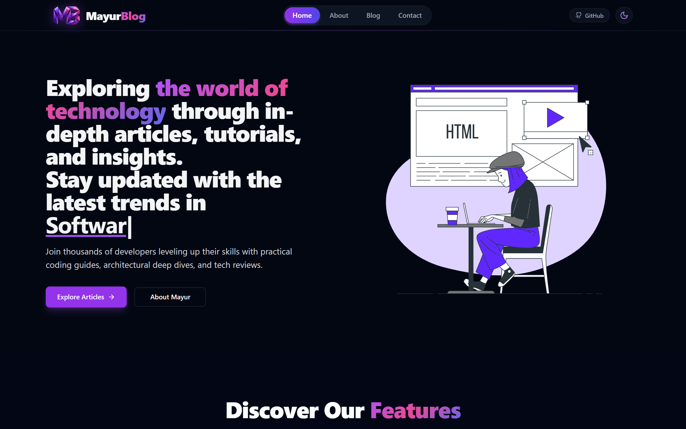
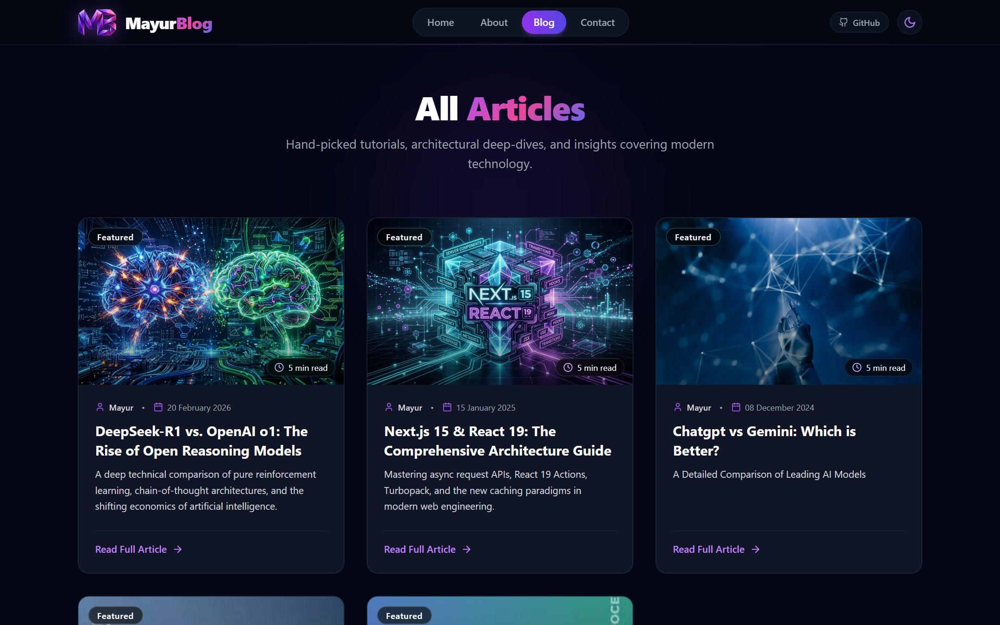
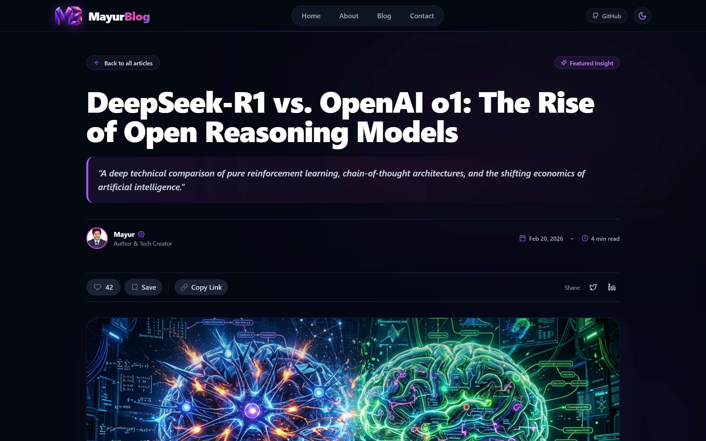
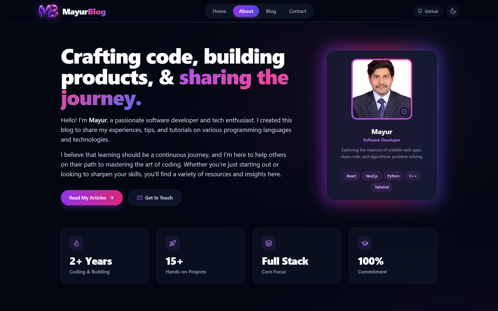
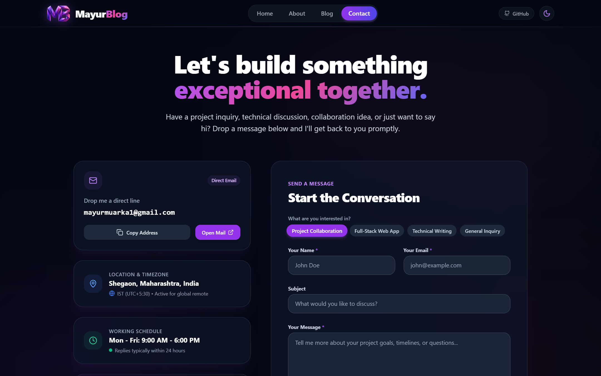

# 🚀 MayurBlog — Modern Full-Stack & AI Tech Publication

[](https://blogapp-nu-one.vercel.app/)
[](https://nextjs.org/)
[](https://react.dev/)
[](https://tailwindcss.com/)
[](LICENSE)

> **Live Website:** [https://blogapp-nu-one.vercel.app/](https://blogapp-nu-one.vercel.app/)  
> **Author & Creator:** [Mayur Murarka](https://mayur-portfolio007.netlify.app/)

Welcome to **MayurBlog**, a high-performance, developer-first publication platform built with **Next.js (App Router)**, **React**, and **Tailwind CSS**. It delivers in-depth architectural breakdowns, AI reasoning model analyses, full-stack tutorials, and coding best practices with a modern, responsive design and dark/light mode aesthetics.

---

## 📸 Visual Showcase & Screenshots

### 1. Home Page (Hero, Dynamic Typing & Feature Showcase)
The homepage features an interactive animated typewriter hero, quick navigation, featured topics, and responsive feature grids.



---

### 2. Explore Articles Page (`/blog`)
A curated catalog displaying technical guides, reading time estimates, category badges, and author info.



---

### 3. In-Depth Technical Article View (`/blogpost/[slug]`)
Rich Markdown rendering with syntax highlighting powered by Rehype/Remark, social sharing, like counter, and bookmarking.



---

### 4. About the Author (`/about`)
Developer bio, milestone statistics, technology proficiency badges, and direct links to connect.



---

### 5. Contact & Collaboration (`/contact`)
Interactive inquiry form with categorized subjects, direct email copy to clipboard, and one-click Gmail integration.



---

## ✨ Key Features (Start to End)

| Feature | Description |
| :--- | :--- |
| ⚡ **Next.js App Router** | Fast, server-first architecture with modern routing and optimized bundle loading. |
| 📝 **Markdown-Powered Engine** | Markdown articles parsed with `gray-matter`, `unified`, `remark-parse`, and `rehype-pretty-code` with syntax highlighting. |
| 🌓 **Seamless Dark & Light Mode** | Fully integrated dark and light themes using `next-themes` with zero flicker on page load. |
| ⌨️ **Interactive Typewriter Hero** | Dynamic headline animation powered by `typed.js` engaging visitors immediately. |
| 🔖 **Article Interaction Tools** | Built-in like button counter, reading time calculations, and one-click social share triggers (Twitter/X, LinkedIn, Copy Link). |
| 📬 **Newsletter Subscription** | Clean, responsive newsletter subscription interface with instant feedback state. |
| 📱 **100% Fully Responsive** | Tailored for ultra-wide monitors, laptops, tablets, and smartphones with mobile drawer navigation. |
| 🔎 **SEO & OpenGraph Ready** | Semantic HTML5 structure, descriptive meta tags, clean URLs, and fast Core Web Vitals. |

---

## 🛠️ Tech Stack & Architecture

### **Frontend & Framework**
- **Framework:** [Next.js](https://nextjs.org/) (App Router)
- **Library:** [React](https://react.dev/)
- **Styling:** [Tailwind CSS](https://tailwindcss.com/) & `@tailwindcss/typography`
- **Component Primitives:** Radix UI (`@radix-ui/react-dialog`, `@radix-ui/react-dropdown-menu`, `@radix-ui/react-slot`)
- **Icons:** [Lucide React](https://lucide.dev/)
- **Animations:** [Typed.js](https://github.com/mattboldt/typed.js/) & `tailwindcss-animate`
- **Theming:** `next-themes`

### **Content Pipeline**
- **Frontmatter Parser:** `gray-matter`
- **Markdown Compiler:** `unified`, `remark-parse`, `remark-rehype`
- **Code Highlighting:** `rehype-pretty-code`
- **Heading Anchors:** `rehype-slug`, `rehype-autolink-headings`

---

## 📂 Project Directory Structure

```text
blogapp/
├── app/                        # Next.js App Router Pages
│   ├── about/                  # About page (/about)
│   ├── api/                    # API endpoints
│   ├── blog/                   # Blog catalog page (/blog)
│   ├── blogpost/[slug]/        # Dynamic markdown article page (/blogpost/:slug)
│   ├── contact/                # Contact and inquiry page (/contact)
│   ├── globals.css             # Design tokens, variables & global styles
│   ├── layout.js               # Root layout (Navbar, Providers, Footer)
│   └── page.js                 # Landing homepage (Hero, Features, Highlights)
├── components/                 # Reusable React components
│   ├── ui/                     # UI components (Navbar, Footer, Buttons, etc.)
│   └── theme-provider.jsx      # Dark/Light theme context provider
├── content/                    # Markdown article source files
│   ├── c-programming-tutorial.md
│   ├── chatgpt-vs-gemini.md
│   ├── css-tutorial.md
│   ├── deepseek-r1-vs-openai-o1.md
│   └── nextjs-15-react-19-guide.md
├── public/                     # Static assets
│   ├── screenshots/            # Website showcase screenshots
│   ├── logo.png                # Brand logo
│   └── ...                     # Article cover images & SVGs
├── scripts/                    # Automation utilities (e.g., screenshot generator)
├── package.json                # Project dependencies and scripts
└── tailwind.config.mjs         # Tailwind styling and animation config
```

---

## 🏁 Getting Started

Follow these steps to run **MayurBlog** locally on your machine.

### **Prerequisites**
- **Node.js**: v18.0.0 or higher
- **npm**, **yarn**, or **pnpm** installed

### **1. Clone the Repository**
```bash
git clone https://github.com/Mayur-Murarka/Mayurblog-app.git
cd Mayurblog-app/blogapp
```

### **2. Install Dependencies**
```bash
npm install
# or
yarn install
# or
pnpm install
```

### **3. Start Development Server**
```bash
npm run dev
# or
yarn dev
```

Open [http://localhost:3000](http://localhost:3000) in your browser to view the application.

---

## 📦 Building for Production

To create an optimized production build:

```bash
npm run build
```

To preview the production build locally:

```bash
npm run start
```

---

## 🚀 Deployment

The fastest way to deploy your blog is using the [Vercel Platform](https://vercel.com/):

1. Push your repository to GitHub.
2. Import the project into **Vercel**.
3. Set the Root Directory to `blogapp` (if in a monorepo or subdirectory).
4. Click **Deploy**. Vercel will automatically build and publish your blog.

Live production URL: **[https://blogapp-nu-one.vercel.app/](https://blogapp-nu-one.vercel.app/)**

---

## ✍️ Adding a New Blog Post

To add a new article to the blog:

1. Create a new `.md` file inside the `content/` directory (e.g., `content/my-new-post.md`).
2. Add frontmatter metadata at the top:
   ```markdown
   ---
   title: "Your Article Title Here"
   description: "A brief summary of your post"
   slug: "my-new-post"
   date: "2026-03-24"
   author: "Mayur Murarka"
   image: "/your-cover-image.jpg"
   ---

   ## Introduction
   Write your markdown content here...
   ```
3. Save the file. The post will automatically appear on the blog list and will be accessible at `/blogpost/my-new-post`!

---

## 👤 Author & Connect

**Mayur Murarka**
- 🌐 **Portfolio:** [mayur-portfolio007.netlify.app](https://mayur-portfolio007.netlify.app/)
- 💻 **GitHub:** [@Mayur-Murarka](https://github.com/Mayur-Murarka)
- 👔 **LinkedIn:** [Mayur Murarka](https://linkedin.com/in/mayur-murarka-178703283/)
- ✉️ **Email:** [mayurmuarka1@gmail.com](mailto:mayurmuarka1@gmail.com)

---
